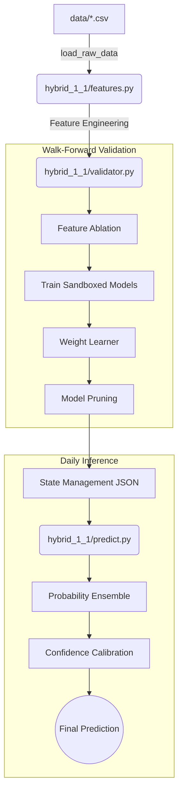

# System Architecture

This document serves as the living map of the `hybrid_1_1` prediction engine. It visually maps the flow of data from raw CSV files to final calibrated predictions.

## Repository Map

## Pipeline Components

### 1. Data Flow (`features.py`)
- Reads raw historical data from the `data/` directory.
- Constructs short-term matrices (1M, 2M, 3M) for tabular models.
- Constructs the `full` historical sequence for deep learning models (LSTMs).

### 2. Validation Pipeline (`validator.py`)
- **Feature Ablation:** Automatically toggles feature groups on and off, discarding groups that increase the Brier Score.
- **Walk-Forward Validation:** Simulates real-time betting by shifting the training window forward in time and predicting the unseen future.
- **Weight Learner:** Assigns voting power to models based on their historic Top-3 accuracy during validation.
- **Model Pruning:** Eliminates weak models that do not significantly contribute to the top 95% of cumulative probability.

### 3. Prediction Pipeline (`predict.py`)
- **Probability Ensemble:** Combines the predictions from all surviving models using their learned weights.
- **Confidence Calibration:** Maps the entropy/spread of the ensemble predictions to a confidence signal (`STRONG`, `GOOD`, `MARGINAL`, `SKIP`).

### 4. State Management
- Saves the exact surviving features, weights, and calibration thresholds to `hybrid_1_1/state/` so inference scripts run instantly without retraining.
