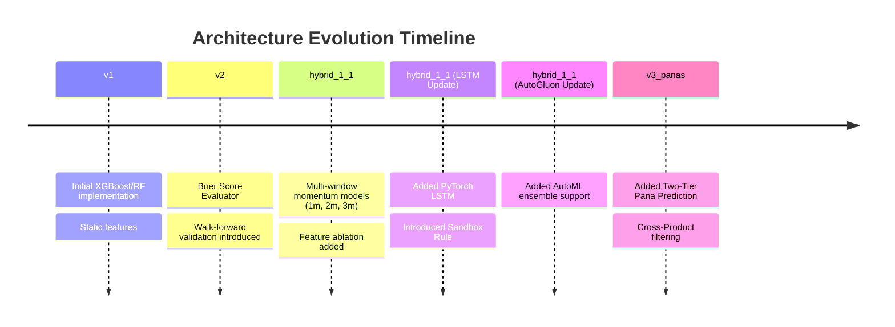

# Model Evolution Timeline

This document tracks the major architectural changes and evolutions of the prediction engine.

## Detailed History

### 1. The Sandbox Rule & LSTM Integration
**Why it was made:** We needed long-term memory (LSTM) but realized it would overfit on the 1m/2m/3m windows due to data starvation.
**Result:** Created the Sandbox Mandate. Tabular models are restricted to short-term momentum windows, while sequence models (LSTM) are restricted to the full historical window.
**Backtest Impact:** LSTM successfully survived pruning for Evening predictions, contributing ~8% voting power and improving Top-3 confidence.

### 2. AutoGluon AutoML Integration
**Why it was made:** To ensure we weren't missing any standard tabular optimization algorithms (like LightGBM or custom Neural Nets).
**Result:** Wrapped `TabularPredictor` in a custom `AutoGluonModel` and restricted training time to 30s per fold.
**Backtest Impact:** Pending validation in continuous experiments.

### 3. Two-Tier Pana Prediction (Cross-Product)
**Why it was made:** Predicting exact 3-digit Panas directly (out of 220 combinations) is statistically unviable.
**Result:** Built a dedicated `panas/` module that predicts Pana Types (SP/DP/TP) based on momentum. The engine cross-references this with the Main Digit prediction to output the exact theoretical combinations (e.g. Double Panas summing to 3).
